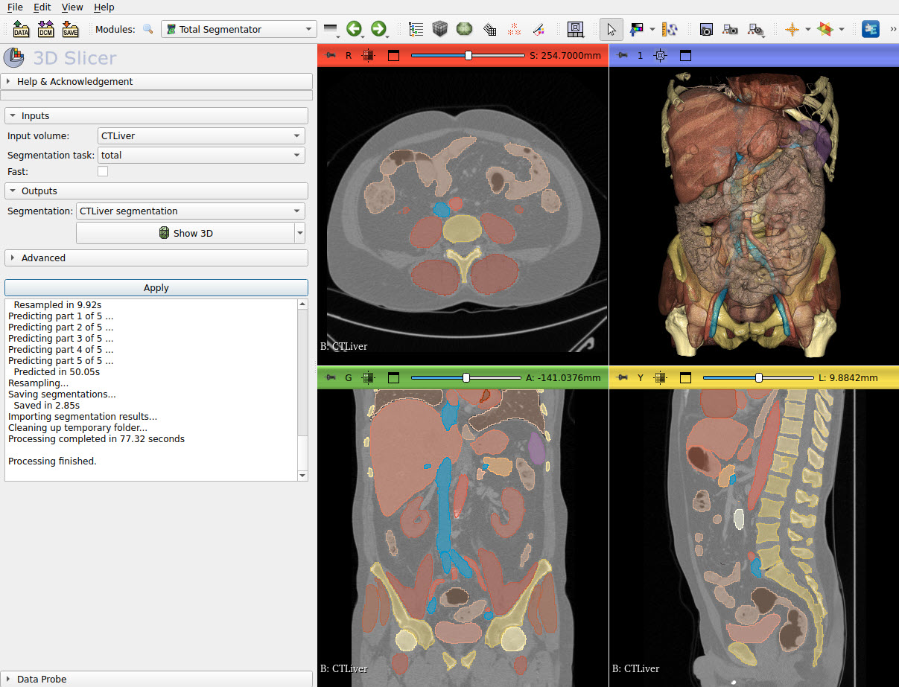

# TotalSegmentator

3D Slicer extension for fully automatic total body segmentation Slicer using "TotalSegmentator" AI model.

If you use the TotalSegmentator nn-Unet function from this software in your research, please cite:

> Wasserthal J., Meyer M., , Hanns-Christian Breit H.C., Cyriac J., Shan Y., Segeroth, M.: TotalSegmentator: robust segmentation of 104 anatomical structures in CT images. https://arxiv.org/abs/2208.05868

## Tutorial

- If you have a CUDA-capable GPU then make sure CUDA is installed to enable faster segmentation (1-2 minutes instead of tens of minutes). You can download CUDA from [here](https://developer.nvidia.com/cuda-downloads).
- Install latest Slicer Preview Release of [3D Slicer](https://slicer.readthedocs.io/en/latest/user_guide/getting_started.html#installing-3d-slicer)
- [Install `TotalSegmentator` extension](https://slicer.readthedocs.io/en/latest/user_guide/extensions_manager.html#install-extensions)
- Start 3D Slicer
- Go to `Sample Data` module and load `CTACardio` data set
- Go to `TotalSegmentator` module
- Select `Input volume` -> `CTACardio`
- Select `Segmentation` -> `Create new segmentation`
- Click `Apply`
  - If you are prompted to install any additional packages then accept that and wait for a couple of minutes. IMPORTANT: You may need up to 20GB free disk space to intall all required Python packages. If installation fails due to running out of disk space then it may leave Python pacakges in the Slicer installation in an inconsistent state and fixing it may only be possible by removing the entire Slicer install folder and reinstall the application.
  - If a GPU is available then results are computed within about 20 seconds. If computation is done on CPU then it may take 10-20 minutes in fast mode!
- To display the segmentation in 3D: go to Data module and drag-and-drop the segmented into the 3D view.

## User interface

- Inputs
  - Input volume: input CT image
  - Fast: performs segmentation faster, but with less accuracy
- Outputs
  - Segmentation: it will contain a brain segment, which specifies the brain region

## Contact

Please post any questions to the [Slicer Forum](https://discourse.slicer.org).

Developers of this extension are not associated with the developers of TotalSegmentator, just provide the convenient 3D Slicer based user interface.
